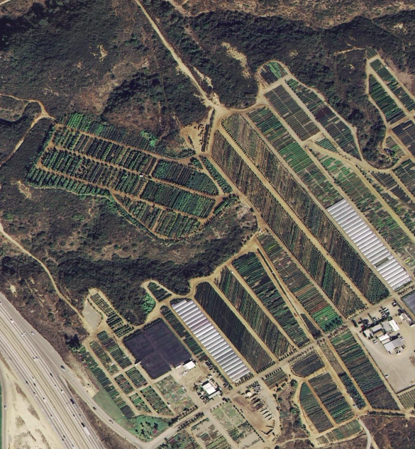
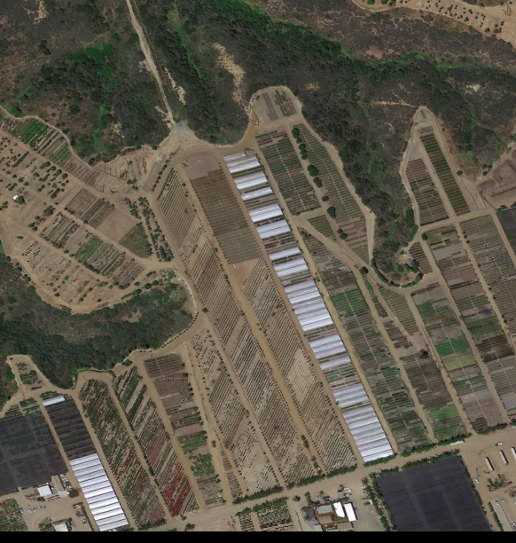

# Привязка снимков к местности (Computer vision)
## Описание
Использование более свежей и гибкой сетки efficientnet дает **0.98** на трейне и **0.96** на сабмите.
Также могу отметить что трейновые данные отличались от подложки. Проделав аугументацию трейнового датасета не принесло буста к результату поэтому решил вообще убрать аугментацию для того чтобы трейн эпохи шли быстрее

## пример снимка и подложки 
Вот так выглядит снимок, чьи координаты надо определить

Здесь уже в качестве примера приложил увеличенную в масштабе подложку, с которой сверяем снимок и определяем координаты 

## презентация
можете просмотреть выжимку по заданию и архитектуре [здесь](https://github.com/status3000/sputnik_hack/blob/main/%D0%9C%D0%A4%D0%A2%D0%98_%D1%85%D0%B0%D0%BA%D0%BA%D0%B0%D1%82%D0%BE%D0%BD.pptx)

## решение
ноутбук с решением - [sputnik_final_version.ipynb](https://github.com/status3000/sputnik_hack/blob/main/sputnik_final_version.ipynb)
